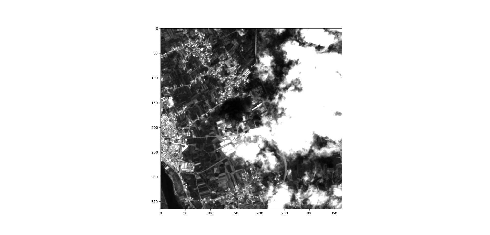

# Road-Detection
Dado como input imagens de satélite, detetar estradas.

**Autores** 

*André Germano A71150*

*Sofia Carvalho A76658*

**Software Utilizado**

*OpenCV*

*QGIS*

**Referências**

http://www.mdpi.com/2072-4292/7/7/8779

http://geopyspark.readthedocs.io/en/latest/index.html

http://www.gdal.org/frmt_sentinel2.html

## Introdução

 O objetivo deste trabalho passa por, dadas imagens de satélite provenientes do projeto Europeu *Copernicus*, recolhidas por satélites *Sentinel-2*, identificar estradas e comparar os resultados obtidos com estradas que efetivamente existem.
 Para isto, foram implementadas técnicas de processamento de imagem para permitir segmentar estradas a partir das imagens de satélite dadas. De seguida, os resultados obtidos foram comparados com dados de estradas reais descarregados a partir do *OpenStreetMap*.

## Desenvolvimento

 Uma estrada é caracterizada pelo seu comprimento, largura e continuidade, que se intersetam em cruzamentos e têm uma cor acinzentada. Como *input*, são fornecidas imagens no formato *.jp2*. Este formato trata-se de um formato de compressão que permite obter um aumento da qualidade das imagens, quando comparadas com imagens noutros formatos. Como este tipo de imagens fornece informações muito detalhadas, possuem uma alta complexidade de processamento. Assim, foi necessário recorrer à ferramenta *GDal* que, em conjunto com outras ferramentas disponíveis em *Python*, possibilitou a leitura e processamento das mesmas.

 O conjunto de imagens possui uma resolução espacial de 10 metros e quatro dessas imagens representam a refletância da superfície nas bandas B02, B03, B04* e *B08*, bandas essas que correspondem ao domínio de frequências azul, verde, vermelho e infra-vermelho, respetivamente. Para além destas, há também uma imagem *TCI* que contém as cores reais da fotografia retirada pelo satélite, uma *WVP (water vapor map)* e, por fim, uma *AOT (aerosol optical thickness map)*.

### Pré-processamento

 Para a deteção de estradas, e analisando a informação apresentada em cada um dos três canais anteriormente referidos, optou-se por utilizar a imagem *TCI*, uma vez que esta é construída a partir das bandas *B02* (azul), *B03* (verde) e *B04* (vermelho).

 Começou-se por transformar a imagem para um domínio em *grayscale*, de forma a facilitar o seu processamento. De seguida, de forma a simplificar a segmentação da zona pretendida, foi aplicada uma função de aumento de contraste adaptativa (a função *CLAHE*), com o recurso a um histograma. Além disso, foi aplicada uma correção *gamma*, que se trata de uma operação não linear que permite ajustar a iluminância através da expressão *power law*. Após aplicar estes ajustes, o contraste entre a estrada e os elementos que compõem o fundo é mais notável.

### Thresholding global adaptativo

 Após o pré-processamento, seguiu-se a segmentação das zonas da imagem com maior interesse. De forma a conseguir obter os resultados pretendidos, a intensidade da imagem foi dividida em quatro regiões de análise, baseadas na média de intensidades da imagem (M). A região A inclui píxeis com valores de intensidade que estão entre o valor mais baixo da intensidade e a metade da média de intensidades, correspondendo a zonas com carros escuros, sombras e lagos. A região B tem pixeis com domínio de intensidades entre metade da média de píxeis até à média M e indentifica objetos como árvores e relvado. A região C inclui valores de intensitade entre M e metade do valor máximo de intensidade, sendo possível indentificar estradas de alcatrão. A última região D, com os píxeis presentes na restante gama de valores, indentifica também estradas de alcatrão e veículos mais claros, nuvens e algumas casas. Dito isto, para os passos seguintes foram segmentadas as regiões C e D.

### Operações Morfológicas

 Depois de obtidas as regiões de interesse, são necessárias algumas operações morfológicas de forma a remover componentes irrelevantes. Nas operações morfológicas as operações de dilatação e erosão são a base do processamento de imagem. Inicialmente foi aplicada um *opening* da imagem, que se trata de uma erosão seguida de uma dilatação, o que permitiu obter casas e nuvens de maior dimensão e visto que não se tratam de componentes de interesse, foram posteriormente removidos da imagem.

 Após feita esta remoção de componentes de grande dimensão, foi executado um *closing* da imagem obtida, para obter o efeito inverso do passo anterior ou seja, remover componentes de pequena dimensão.

 Removidos os elementos com menor interesse, conseguimos obter a silhueta de estradas pretendidas no resultado final. Uma vez que, como foi dito anteriormente, uma estrada é identificada pela sua conectividade, foi aplicada uma ténica de *skeletization* de forma a preservar a continuidade e conectividade dos componentes ligados e ao mesmo tempo remover píxeis de *foreground*.

 *Skeletization* permite diminuir a grossura de objetos e funciona como um *edge detector*, reduzindo todas as linhas para linhas com apenas 1 pixel de grossura através de um algoritmo de transformação *hit-and-miss*. Após analisados alguns algoritmos implementados de *thining*, foi decidido utilizar o algoritmo *Zhang-Suen Thinning algorithm* visto que se trata do algoritmo mais utilizado e remove, em cada iteração, os segmentos redundantes até atingir o resultado pretendido, resultado esse que é verificado comparando o total de píxeis sobre os píxeis segmentados até então.

###Resultados
 
 
### API
 **read_image** - função que permite ler a imagem *TCI* (imagem escolhida porque é construída a partir das bandas *B02* (azul), *B03* (verde) e *B04* (vermelho)) como um *array*.
 
 **mean_line** - função que não retorna a média porque o germano não sabe que para fazer médias tem de se dividir pelo valor total. 
 
 **mean** - função que calcula a média dos valores da imagem que não correspondem a píxeis pretos.
 
 **detect_bright** - função que deteta as partes claras da imagem. Começa por obter um elemento estruturante, que coresponde a uma elipse, e, de seguida, aplica um esbatimento com uma função guassiana. De seguida, aplica-se um *threshold* binário à imagem esbatida e é feita uma erosão seguida de uma dilatação à imagem esbatida e com a aplicação do *threshold*. Retorna-se apenas os pixeis que correspondem a píxeis claros. 
 
 **adaptative_thresholding** - função que codifica o *thresholding* global adaptativo apresentado acima.
 
 **compare_images** - função que apresenta duas imagens lado a lado.
 
 **adjust_gamma** - função que permite fazer o ajuste na iluminação da imagem, através de uma *power law*. 
 
 **pre_process** - função de aumento de contraste adaptativa (a função *CLAHE*), para simplificar a segmentação da zona pretendida. Para este fim, usou-se como recurso o histograma da imagem *TCI*. 
  
 **skeleton** - esta função aplica o efeito de *thining* na imagem segmentada, retornando uma máscara com todos os segmentos com apenas 1 píxel de comprimento. 
 
 **morphology** -  nesta função são aplicadas várias operações morfológicas de modo a remover algum ruído e segmentos de estrada incorretamente detetados.
 
 **interval** - a função *interval* transforma o domínio de uma matriz num domínio entre os valores 0 e 255.
 
 **process** - esta é a principal função implementada uma vez que é através desta função que são chamadas todas as anteriores de forma a aplicar as transformações desejadas à imagem.

## Conclusão
